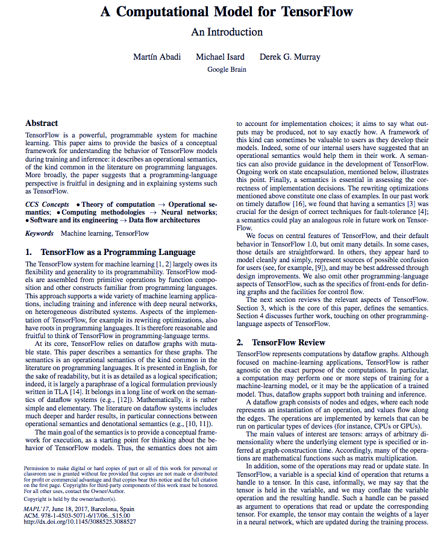
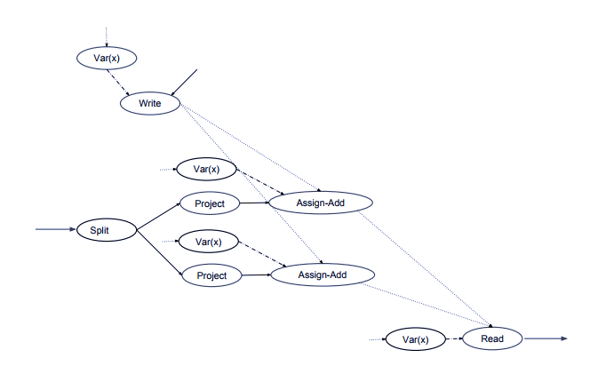
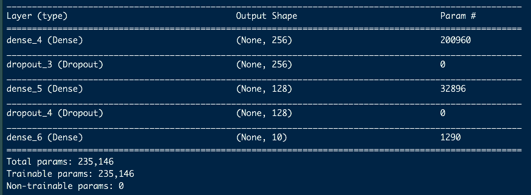
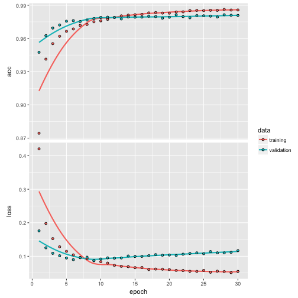

Working with TensorFlow from R
========================================================
author: Joseph Rickert
date: November 14, 2017
autosize: true

This Talk
========================================================

[`TensorFlow`](https://github.com/tensorflow/tensorflow) has emerged as the premiere platform for Deep Learning and the production deployment of machine learning models.

[`Keras`](https://keras.io/) is a high-level neural networks API, written in Python and capable of running on top of [`TensorFlow`](https://github.com/tensorflow/tensorflow), [`CNTK`](https://github.com/Microsoft/cntk), or [`Theano`](https://github.com/Theano/Theano) written in Python. 

In this talk we will look at how RStudio is using `Keras` to provide access to `TensorFlow` Deep Learning Models from R.

TensorFlow
========================================================
- Although `TensorFlow` is associated with Deep Learning, it is a general purpose library for numerical computation that uses flow graphs.
- Nodes in a `TensorFlow` graph represent mathematical operations
- Data organized as multidimensional data arrays (tensors) that flow along the edges. 
- Edges may also indicate control signals that constrain the order of execution.
- The [paper](https://dl.acm.org/citation.cfm?doid=3088525.3088527) by Abadi, Isard and Murray from the Google Brain team that developed `TensorFlow` describes the computational model in some detail.

TensorFlow Paper
========================================================



TensorFlow Graph
========================================================


Getting TensorFlow
========================================================
- The first step is to install R package [keras](https://cran.r-project.org/package=keras) from CRAN
- The `install_keras()` function installs both `Keras` and `TensorFlow`
- The default is to install on your local machine
- The documentation for `install_keras` describes how to do custom installations (including using NVIDIA GPUs)

Installing TensorFlow
========================================================
The `install_keras()` function installs `Keras`, `TensorFlow` and all of the necessary `Python` machinery.


```r
#install.packages("keras")
#library(keras)
#install_keras()   
```

The MNIST Example
=========================================================
The [MNIST](https://en.wikipedia.org/wiki/MNIST_database) dataset contains: 
- 60,000 28x28 grayscale images of the 10 digits
- Labels for each image
- An additional test set of 10,000 images.
- Is used to train image processing systems 
- Is included in the `keras` package. 

Typical Grayscale Image
==========================================================
A typical MNIST grayscale image looks something like this:

   

Load the Keras Library and look at MNIST
===========================================================

```r
library(keras)
mnist <- dataset_mnist()
str(mnist,give.attr = FALSE)
```

```
List of 2
 $ train:List of 2
  ..$ x: int [1:60000, 1:28, 1:28] 0 0 0 0 0 0 0 0 0 0 ...
  ..$ y: int [1:60000(1d)] 5 0 4 1 9 2 1 3 1 4 ...
 $ test :List of 2
  ..$ x: int [1:10000, 1:28, 1:28] 0 0 0 0 0 0 0 0 0 0 ...
  ..$ y: int [1:10000(1d)] 7 2 1 0 4 1 4 9 5 9 ...
```

Organize Data for TensorFlow
===========================================================
Here, we organize the data for conveniently feeding it to `TensorFlow`. The x data is a 3-d array (images,width,height) of grayscale values.


```r
x_train <- mnist$train$x
y_train <- mnist$train$y
x_test <- mnist$test$x
y_test <- mnist$test$y
```

Reshape for Training
===========================================================
- Convert the 3-d arrays into matrices by reshaping width and height into a single dimension (28x28 images are flattened into length 784 vectors)
- Convert the grayscale values from integers ranging between 0 to 255 into floating point values ranging between 0 and 1. 
- The y data is an integer vector with values ranging from 0 to 9
- [one-hot encode](https://www.quora.com/What-is-one-hot-encoding-and-when-is-it-used-in-data-science) the vectors into binary class matrices using the function `keras::to_categorical()`.

Reshape the Data     
===========================================================

Note: the `array_reshape()` function and not an R function is used to reshape the array. This is so that the data is re-interpreted using row-major semantics (as opposed to R’s default column-major semantics), which is compatible with the way that the numerical libraries called by Keras.


```r
# reshape
dim(x_train) <- c(nrow(x_train), 784)
dim(x_test) <- c(nrow(x_test), 784)
# rescale
x_train <- x_train / 255
x_test <- x_test / 255

y_train <- to_categorical(y_train, 10)
y_test <- to_categorical(y_test, 10)
```

Define the Keras Model
==============================================================
In Keras, data is organized into layers. A model in Keras is a collection of layers. The simplest type of model is the [sequential model](https://keras.rstudio.com/articles/sequential_model.html) which is a linear stack of layers.

- Begin by creating a sequential model using the sequential model constructor `keras_model_sequential` 
- Then adding layers using the pipe `%>%` operator 
- `layer_dense()` adds a densely-connected NN layer

Create Sequential Model:
================================================================

```r
model <- keras_model_sequential() 
model %>% 
  layer_dense(units = 256, activation = "relu", input_shape = c(784)) %>% 
  layer_dropout(rate = 0.4) %>% 
  layer_dense(units = 128, activation = "relu") %>%
  layer_dropout(rate = 0.3) %>%
  layer_dense(units = 10, activation = "softmax")
```


Arguments to `keras_model_sequential`
================================================================
- The `units` argument defines the dimension of the output space 
- `activation` = "relu" indicates that nodes in this layer will be [activated](https://en.wikipedia.org/wiki/Activation_function) as rectified linear units, [ReLU](https://en.wikipedia.org/wiki/Rectifier_(neural_networks))

- `input_shape` specifies the dimensionality of the input 784 is the length of the grayscale image 
- rate = .4 in `layer_dropout()` means that 40% of the units will randomly be set to 0 during the training. This is a technique to prevent overfitting
- The final layer outputs a length 10 numeric vector (probabilities for each digit) using a [softmax activation](https://en.wikipedia.org/wiki/Softmax_function) function

Summarize the model
=================================================================
The 200,960 parameters in the first layer comes from (784 inputs) * (256 neurons) + (256 bias values).


```r
#summary(model)
```
 

Compile the Model
==================================================================
Before training a keras model you need to configure the learning process. This done with the [`compile`](https://faroit.github.io/keras-docs/1.0.1/getting-started/sequential-model-guide/) function.


```r
model %>% compile(
  loss = "categorical_crossentropy",
  optimizer = optimizer_rmsprop(),
  metrics = c("accuracy"))
```

Compile Parameters
====================================================================

- `loss` specifies the loss function that the model will attempt to minimize. Look [here](https://en.m.wikipedia.org/wiki/Cross_entropy) for a discussion of categorical cross entropy. 
- `optimizer` specifies the optimization algorithm to be used. In this case, we use the [remsprop](http://climin.readthedocs.io/en/latest/rmsprop.html) optimizer which uses the magnitude of recent gradients to normalize gradients. The [keras documentation](https://keras.io/optimizers/) suggests that this is usually a good choice for recurrent neural networks. 
- Look [here](https://www.tensorflow.org/api_docs/python/tf/metrics/accuracy) to see how `TensorFlow` calculates accuracy.

Fit the Model
====================================================================

We fit the model for 30 epochs using batches of 128 images and specifying that 20% of the training data will be used for validation.

```r
history <- model %>% fit(
  x_train, y_train, 
  epochs = 30, batch_size = 128, 
  validation_split = 0.2
)
```

Look at Model Object
=====================================================================


```r
str(history)
```

```
List of 2
 $ params :List of 8
  ..$ metrics           : chr [1:4] "loss" "acc" "val_loss" "val_acc"
  ..$ epochs            : int 30
  ..$ steps             : NULL
  ..$ do_validation     : logi TRUE
  ..$ samples           : int 48000
  ..$ batch_size        : int 128
  ..$ verbose           : int 1
  ..$ validation_samples: int 12000
 $ metrics:List of 4
  ..$ acc     : num [1:30] 0.874 0.941 0.955 0.962 0.966 ...
  ..$ loss    : num [1:30] 0.421 0.198 0.153 0.128 0.115 ...
  ..$ val_acc : num [1:30] 0.948 0.963 0.969 0.972 0.976 ...
  ..$ val_loss: num [1:30] 0.1759 0.1251 0.1087 0.1017 0.0947 ...
 - attr(*, "class")= chr "keras_training_history"
```

Plot the Model Fit
=======================================================================
Plot accuracy and loss for both the training and validation for 30 epochs.

```r
plot(history)
```



Evaluate Model Performance
=========================================================================

```r
model %>% evaluate(x_test, y_test,verbose = 0)
```

```
$loss
[1] 0.1018275

$acc
[1] 0.9819
```

Generate Predictions
=========================================================================
The `predict_classes()` function can be used to generate predictions for new data.

```r
model %>% predict_classes(x_test)
```

```
    [1] 7 2 1 0 4 1 4 9 5 9 0 6 9 0 1 5 9 7 3 4 9 6 6 5 4 0 7 4 0 1 3 1 3 4
   [35] 7 2 7 1 2 1 1 7 4 2 3 5 1 2 4 4 6 3 5 5 6 0 4 1 9 5 7 8 9 3 7 4 6 4
   [69] 3 0 7 0 2 9 1 7 3 2 9 7 7 6 2 7 8 4 7 3 6 1 3 6 9 3 1 4 1 7 6 9 6 0
  [103] 5 4 9 9 2 1 9 4 8 7 3 9 7 4 4 4 9 2 5 4 7 6 7 9 0 5 8 5 6 6 5 7 8 1
  [137] 0 1 6 4 6 7 3 1 7 1 8 2 0 2 9 9 5 5 1 5 6 0 3 4 4 6 5 4 6 5 4 5 1 4
  [171] 4 7 2 3 2 7 1 8 1 8 1 8 5 0 8 9 2 5 0 1 1 1 0 9 0 3 1 6 4 2 3 6 1 1
  [205] 1 3 9 5 2 9 4 5 9 3 9 0 3 6 5 5 7 2 2 7 1 2 8 4 1 7 3 3 8 8 7 9 2 2
  [239] 4 1 5 9 8 7 2 3 0 2 4 2 4 1 9 5 7 7 2 8 2 0 8 5 7 7 9 1 8 1 8 0 3 0
  [273] 1 9 3 4 1 8 2 1 2 9 7 5 9 2 6 4 1 5 8 2 9 2 0 4 0 0 2 8 4 7 1 2 4 0
  [307] 2 7 4 3 3 0 0 3 1 9 6 5 2 5 8 7 9 3 0 4 2 0 7 1 1 2 1 5 3 3 9 7 8 6
  [341] 5 6 1 3 8 1 0 5 1 3 1 5 5 6 1 8 5 1 7 9 4 6 2 2 5 0 6 5 6 3 7 2 0 8
  [375] 8 5 4 1 1 4 0 7 3 7 6 1 6 2 1 9 2 8 6 1 9 5 2 5 4 4 2 8 3 8 2 4 5 0
  [409] 3 1 7 7 5 7 9 7 1 9 2 1 4 2 9 2 0 4 9 1 4 8 1 8 4 5 9 8 8 3 7 6 0 0
  [443] 3 0 2 0 6 4 9 3 3 3 2 3 9 1 2 6 8 0 5 6 6 6 3 8 8 2 7 5 8 9 6 1 8 4
  [477] 1 2 5 9 1 9 7 5 4 0 8 9 9 1 0 5 2 3 7 8 9 4 0 6 3 9 5 2 1 3 1 3 6 5
  [511] 7 4 2 2 6 3 2 6 5 4 8 9 7 1 3 0 3 8 3 1 9 3 4 4 6 4 2 1 8 2 5 4 8 8
  [545] 4 0 0 2 3 2 7 7 0 8 7 4 4 7 9 6 9 0 9 8 0 4 6 0 6 3 5 4 8 3 3 9 3 3
  [579] 3 7 8 0 2 2 1 7 0 6 5 4 3 8 0 9 6 3 8 0 9 9 6 8 6 8 5 7 8 6 0 2 4 0
  [613] 2 2 3 1 9 7 5 8 0 8 4 6 2 6 7 9 3 2 9 8 2 2 9 2 7 3 5 9 1 8 0 2 0 5
  [647] 2 1 3 7 6 7 1 2 5 8 0 3 7 2 4 0 9 1 8 6 7 7 4 3 4 9 1 9 5 1 7 3 9 7
  [681] 6 9 1 3 3 8 3 3 6 7 2 4 5 8 5 1 1 4 4 3 1 0 7 7 0 7 9 4 4 8 5 5 4 0
  [715] 8 2 1 0 8 4 8 0 4 0 6 1 9 3 2 6 7 2 6 9 3 1 4 6 2 5 9 2 0 6 2 1 7 3
  [749] 4 1 0 5 4 3 1 1 7 4 9 9 4 8 4 0 2 4 5 1 1 6 4 7 1 9 4 2 4 1 5 5 3 8
  [783] 3 1 4 5 6 8 9 4 1 5 3 8 0 3 2 5 1 2 8 3 4 4 0 8 8 3 3 1 7 3 5 9 6 3
  [817] 2 6 1 3 6 0 7 2 1 7 1 4 2 4 2 1 7 9 6 1 1 2 4 8 1 7 7 4 8 0 7 3 1 3
  [851] 1 0 7 7 0 3 5 5 2 7 6 6 9 2 8 3 5 2 2 5 6 0 8 2 9 2 8 8 8 8 7 4 4 3
  [885] 0 6 6 3 2 1 3 2 2 9 3 0 0 5 7 8 3 4 4 6 0 2 9 1 4 7 4 7 3 9 8 8 4 7
  [919] 1 2 1 2 2 3 7 3 2 3 9 1 7 4 0 3 5 5 8 6 3 2 6 7 6 6 3 2 7 8 1 1 7 5
  [953] 6 4 9 5 2 3 3 4 7 8 9 1 1 0 9 1 4 4 5 4 0 6 2 2 3 1 5 1 2 0 3 8 1 2
  [987] 6 7 1 6 2 3 9 0 1 2 2 0 8 9 9 0 2 5 1 9 7 8 1 0 4 1 7 9 5 4 2 6 8 1
 [1021] 3 7 5 4 4 1 8 1 3 8 1 2 5 8 0 6 2 1 1 2 1 5 3 4 6 9 5 0 9 2 2 4 8 2
 [1055] 1 7 2 4 9 4 4 0 3 9 2 2 3 3 8 3 5 7 3 5 8 1 2 4 4 6 4 9 5 1 0 6 9 5
 [1089] 9 5 9 7 3 8 0 3 7 1 3 6 7 8 5 9 7 9 6 9 6 3 7 4 6 5 3 5 4 7 8 7 8 0
 [1123] 7 6 8 8 7 3 3 1 9 5 2 7 3 5 1 1 2 1 4 7 4 7 5 4 5 4 0 8 3 6 9 6 0 2
 [1157] 8 4 4 4 4 6 6 4 7 9 3 4 5 5 8 7 3 7 2 7 0 2 0 1 1 6 8 9 2 8 7 2 0 1
 [1191] 5 0 4 1 7 0 6 0 8 6 8 1 8 0 3 3 7 2 3 6 2 1 6 1 1 3 7 9 0 8 0 5 4 0
 [1225] 2 8 2 2 9 8 4 0 8 5 8 5 1 2 1 3 1 7 9 5 7 2 0 5 8 8 6 2 5 4 1 9 2 1
 [1259] 5 8 1 0 2 4 4 3 6 8 8 2 4 0 5 0 4 4 7 9 3 4 1 5 9 7 3 5 8 8 0 5 3 3
 [1293] 6 6 0 1 6 0 3 5 4 4 1 2 9 1 4 6 9 9 3 9 8 4 4 3 1 3 1 3 8 7 9 4 8 8
 [1327] 7 9 8 1 4 5 6 0 5 2 2 2 1 5 5 2 4 9 6 2 7 7 2 2 1 1 2 8 3 7 2 4 1 7
 [1361] 1 7 6 7 8 2 7 3 1 7 5 8 2 6 2 2 5 6 5 0 9 2 4 3 3 9 7 6 6 8 0 4 1 3
 [1395] 8 2 9 1 8 0 6 7 2 1 0 5 5 2 0 2 2 0 2 4 9 8 0 9 9 4 6 5 4 9 1 8 3 4
 [1429] 9 9 1 2 2 8 1 9 6 4 0 9 4 8 3 8 6 0 2 5 1 9 6 2 9 4 0 9 6 0 6 2 5 4
 [1463] 2 3 8 4 5 5 0 3 8 5 3 5 8 6 5 7 6 3 3 9 6 1 1 2 9 0 4 3 3 6 9 5 7 3
 [1497] 7 7 7 8 3 9 8 3 0 7 2 7 9 4 5 4 9 3 2 1 4 0 2 3 7 5 9 8 8 5 0 1 1 4
 [1531] 7 3 9 0 0 0 6 6 2 3 7 8 4 7 7 9 2 4 1 6 5 2 4 9 9 1 8 4 0 9 8 4 8 7
 [1565] 7 0 7 8 8 6 0 4 8 8 2 4 7 6 6 6 4 7 1 8 8 2 3 6 3 0 0 3 7 6 9 7 9 9
 [1599] 5 4 3 3 6 1 2 3 7 3 3 2 0 8 3 8 4 3 6 3 5 0 2 0 9 0 7 4 6 9 3 5 1 9
 [1633] 6 1 4 5 4 5 0 5 9 5 2 1 2 9 1 9 9 4 0 8 4 5 2 9 2 1 2 1 7 3 6 8 8 4
 [1667] 9 1 9 8 5 7 5 1 1 8 6 5 2 4 4 7 2 3 5 6 8 8 6 2 3 1 0 5 8 9 2 9 6 7
 [1701] 0 4 8 7 1 7 4 1 0 9 7 2 0 0 9 1 7 0 7 8 4 7 2 0 4 6 0 3 1 1 3 3 9 6
 [1735] 7 4 1 5 3 0 8 7 3 9 6 9 3 5 0 2 7 2 5 1 2 5 8 0 8 8 1 5 0 3 0 3 1 4
 [1769] 0 3 7 2 7 1 8 0 7 0 4 3 1 9 8 7 7 1 4 9 9 3 8 1 7 9 0 2 0 3 3 7 6 9
 [1803] 2 3 3 7 7 0 0 7 5 2 9 8 7 4 4 2 6 6 1 9 6 8 2 9 0 8 3 1 1 6 3 5 1 1
 [1837] 1 3 1 2 3 0 2 0 1 3 5 5 7 4 8 9 6 9 6 8 3 6 6 8 5 1 4 2 4 4 5 1 1 9
 [1871] 0 2 4 9 5 7 1 8 8 5 6 9 8 7 1 1 6 7 6 3 2 2 0 8 9 2 5 1 0 8 1 4 5 7
 [1905] 9 6 9 0 6 1 5 5 8 3 8 2 6 5 0 7 4 6 1 3 4 7 3 2 3 4 2 5 2 7 1 7 2 6
 [1939] 4 1 5 7 8 6 0 1 8 2 5 7 7 6 9 3 5 8 4 2 4 0 8 8 3 4 9 2 7 5 8 6 5 6
 [1973] 0 8 6 7 3 6 4 9 4 6 6 3 2 4 1 0 1 4 6 2 9 1 1 0 6 3 9 5 6 5 6 5 9 4
 [2007] 6 4 3 9 1 3 4 1 9 1 2 1 8 9 3 5 4 0 9 3 6 1 7 5 5 3 3 0 1 5 7 5 8 6
 [2041] 5 1 0 8 2 3 4 6 7 9 8 1 8 9 9 2 8 6 2 7 0 0 6 7 5 8 6 0 9 3 7 1 3 5
 [2075] 4 3 3 5 5 6 3 0 2 3 4 2 3 0 9 9 4 7 2 8 4 7 0 6 2 8 5 2 8 5 7 3 0 8
 [2109] 2 7 2 8 2 5 5 7 6 4 6 8 4 8 2 7 4 5 2 0 3 8 9 6 7 2 5 1 1 1 2 3 6 7
 [2143] 8 7 6 4 8 9 4 8 6 3 8 3 1 0 6 2 2 5 6 9 5 8 1 4 1 7 8 4 6 1 8 4 3 1
 [2177] 2 8 0 8 5 9 2 4 2 0 2 7 0 9 0 2 5 7 6 7 9 4 2 6 2 4 4 8 0 4 4 5 8 0
 [2211] 6 8 9 8 5 6 9 0 4 8 7 1 3 4 5 8 0 9 1 3 3 6 9 8 7 1 0 5 7 1 7 5 2 7
 [2245] 9 1 8 5 2 4 9 4 7 2 2 3 4 9 1 9 2 1 7 9 4 4 1 6 7 2 7 8 8 1 9 7 1 1
 [2279] 7 5 3 3 5 1 3 7 6 1 3 8 7 5 9 6 0 0 2 8 8 2 3 7 1 3 0 3 4 4 3 8 9 2
 [2313] 3 9 7 1 1 7 0 4 9 6 5 9 1 7 0 2 0 2 4 6 7 0 7 1 4 6 4 5 4 9 9 1 7 9
 [2347] 5 3 3 8 2 3 6 2 2 1 1 1 1 1 6 9 8 4 3 7 1 6 4 8 0 4 7 4 2 4 0 7 0 1
 [2381] 9 8 8 6 0 0 4 1 6 8 2 2 3 8 4 8 2 2 1 7 5 4 4 0 4 3 9 7 3 1 0 1 2 5
 [2415] 4 2 1 0 1 8 9 1 4 8 3 8 9 3 6 2 8 3 2 2 1 0 4 2 9 2 4 3 7 9 1 5 2 4
 [2449] 9 0 3 8 5 3 6 0 9 4 6 2 5 0 2 7 4 6 6 8 6 6 8 6 9 1 7 2 5 9 9 0 7 2
 [2483] 7 6 7 0 6 5 4 4 7 2 0 9 9 2 2 9 4 4 2 3 3 2 1 7 0 7 6 4 1 3 8 7 4 5
 [2517] 9 2 5 1 8 7 3 7 1 5 5 0 9 1 4 0 6 3 3 6 0 4 9 7 5 1 6 8 9 5 5 7 9 3
 [2551] 8 3 8 1 5 3 5 0 5 5 3 8 6 7 7 7 3 7 0 5 9 0 2 5 5 3 1 7 7 8 6 5 9 3
 [2585] 8 9 5 3 7 9 1 7 0 0 3 7 2 5 1 1 8 6 2 9 5 7 5 7 8 6 2 5 1 4 8 4 5 8
 [2619] 3 0 6 2 7 3 3 2 1 0 7 3 4 0 3 9 3 2 8 9 0 3 8 0 7 6 5 4 7 3 0 0 8 6
 [2653] 2 5 1 1 0 0 4 4 0 1 2 3 2 7 7 8 5 2 5 7 6 9 1 4 1 6 4 2 4 3 5 4 3 9
 [2687] 5 0 1 5 3 8 9 1 9 7 9 5 5 2 7 4 6 0 1 1 1 0 4 4 7 6 3 0 0 4 3 0 6 1
 [2721] 9 6 1 3 8 1 2 5 6 2 7 3 6 0 1 9 7 6 6 8 9 2 9 5 8 3 1 0 0 7 6 6 2 1
 [2755] 6 9 3 1 8 6 9 0 6 0 0 0 6 3 5 9 3 4 5 5 8 5 3 0 4 0 2 9 6 8 2 3 1 2
 [2789] 1 1 5 6 9 8 0 6 6 5 5 3 8 6 2 1 4 5 4 3 7 8 3 0 9 3 5 1 1 0 4 4 7 0
 [2823] 1 7 0 1 6 1 4 5 6 6 5 7 8 4 4 7 2 5 3 7 0 7 7 9 6 4 2 8 5 7 8 3 9 5
 [2857] 8 9 9 8 6 2 8 9 2 3 6 1 1 8 9 3 4 0 7 9 6 4 1 4 1 3 4 9 3 1 4 7 7 4
 [2891] 7 2 9 3 0 8 8 8 4 0 4 4 1 5 2 8 3 4 9 5 2 8 1 5 3 3 9 4 2 5 6 0 5 9
 [2925] 3 5 9 2 1 9 5 3 0 6 9 8 4 0 4 5 2 9 0 1 0 3 1 6 5 8 1 5 3 5 0 3 5 5
 [2959] 9 2 8 7 0 4 9 1 9 7 7 5 5 2 0 9 1 8 6 2 3 9 6 2 1 9 1 3 5 5 0 3 8 3
 [2993] 3 7 6 5 0 1 4 0 6 9 8 1 2 9 9 5 9 7 3 7 8 0 1 3 0 4 6 1 0 2 5 8 4 4
 [3027] 1 1 5 4 8 6 0 6 9 2 6 2 7 1 7 9 4 0 0 3 8 2 2 3 1 6 0 5 7 7 9 2 6 7
 [3061] 9 7 5 6 8 8 4 6 8 4 1 2 8 2 3 9 4 0 3 7 3 2 3 3 7 3 4 0 6 2 0 8 1 5
 [3095] 3 5 4 1 7 1 5 7 5 7 3 2 2 7 3 7 3 7 8 5 4 5 2 9 6 5 3 6 7 4 1 7 1 5
 [3129] 2 3 6 3 1 4 2 6 7 4 3 8 0 6 2 1 6 5 3 9 1 9 3 2 1 8 4 4 6 5 8 6 9 7
 [3163] 7 8 6 9 7 3 9 4 0 5 4 6 4 1 2 3 0 0 2 6 6 5 7 0 8 6 4 7 9 0 7 3 4 2
 [3197] 1 8 8 5 9 2 7 1 8 8 8 2 7 6 0 1 2 7 1 0 8 3 6 0 5 3 6 2 8 7 0 1 4 2
 [3231] 1 1 4 4 4 4 7 1 6 2 9 9 0 0 1 8 8 4 3 4 2 0 6 1 6 1 2 2 2 1 2 3 7 8
 [3265] 1 0 0 2 1 6 6 0 1 6 2 5 1 7 4 8 2 1 4 3 8 3 9 9 4 8 3 4 7 2 7 5 7 0
 [3299] 4 3 3 2 6 7 6 0 0 6 7 7 0 5 5 8 1 0 7 0 2 8 1 5 0 8 8 0 3 2 7 7 2 6
 [3333] 4 7 5 5 7 2 9 2 8 4 6 8 6 5 0 0 8 7 6 1 7 1 1 2 7 4 0 0 7 7 6 3 8 6
 [3367] 4 2 0 9 4 0 5 7 8 2 7 4 7 1 1 3 6 6 2 9 1 9 4 8 3 6 9 5 9 6 2 4 6 7
 [3401] 7 0 6 6 9 4 8 3 5 3 4 9 0 0 5 2 5 0 7 1 1 1 0 7 6 7 9 6 6 4 1 4 3 1
 [3435] 1 2 2 4 1 0 8 7 6 3 4 0 0 6 3 3 0 3 1 7 1 1 3 1 0 9 9 7 5 4 1 4 8 9
 [3469] 5 3 5 1 9 8 2 7 3 9 9 0 1 0 2 9 3 9 3 3 6 2 4 9 8 3 7 4 0 4 7 8 4 9
 [3503] 8 1 9 7 5 9 2 8 2 2 0 2 2 3 8 4 6 8 4 8 2 4 6 7 9 3 3 9 4 3 1 4 4 7
 [3537] 0 5 9 6 0 4 4 4 4 6 1 2 3 2 6 4 5 9 6 8 5 6 0 5 6 4 1 8 6 5 2 5 4 5
 [3571] 5 4 7 7 0 7 8 2 2 3 7 0 1 8 0 7 1 9 8 7 5 5 9 1 7 5 4 3 1 2 2 1 6 6
 [3605] 0 1 1 4 0 7 4 2 4 0 6 4 7 6 9 5 3 4 6 5 0 1 8 8 2 8 3 5 7 8 0 8 5 7
 [3639] 1 1 0 1 3 7 8 5 0 7 1 1 0 1 1 4 5 2 7 6 2 3 0 2 8 5 9 6 9 7 2 1 3 6
 [3673] 4 1 8 2 4 0 5 1 0 2 2 6 4 4 3 9 6 1 6 5 7 9 2 0 2 6 0 1 4 3 5 2 8 8
 [3707] 0 8 8 9 0 9 6 7 6 3 9 3 4 7 7 7 4 9 0 6 4 4 4 2 7 2 8 1 0 0 7 8 3 3
 [3741] 3 1 3 7 6 1 3 1 6 6 5 2 4 7 5 9 5 8 4 9 9 1 6 5 0 1 3 7 0 3 4 8 2 2
 [3775] 0 2 5 1 5 1 6 8 8 9 1 2 1 3 5 1 0 9 4 4 8 3 2 5 9 7 6 6 2 0 0 0 5 8
 [3809] 3 1 5 2 3 8 5 1 8 2 0 4 9 9 6 2 3 3 5 6 4 8 0 9 2 8 3 6 7 5 1 2 9 4
 [3843] 9 1 2 8 6 0 7 0 9 1 1 6 7 5 9 9 1 9 5 9 2 5 0 4 1 0 8 4 0 8 9 8 9 4
 [3877] 2 5 7 9 8 9 8 0 9 9 6 8 9 9 5 9 8 6 1 0 3 3 5 2 1 6 3 0 2 8 2 5 6 2
 [3911] 3 0 2 2 6 4 3 5 5 1 7 2 1 6 9 1 9 9 5 5 1 6 2 2 8 6 7 1 4 6 0 6 0 5
 [3945] 3 2 2 3 6 8 9 8 5 3 8 5 4 5 2 0 5 6 3 2 8 3 9 9 5 7 9 4 6 7 1 3 1 3
 [3979] 6 6 0 9 0 1 9 4 2 8 8 0 1 6 9 7 5 3 4 7 4 9 8 4 3 6 3 1 1 7 6 9 1 8
 [4013] 4 1 1 9 9 4 3 6 8 1 6 0 4 1 3 1 7 4 9 5 1 0 0 1 1 6 2 1 9 8 4 0 3 6
 [4047] 4 9 0 7 1 6 5 7 5 2 5 1 8 5 4 7 0 6 7 3 2 5 8 1 0 4 5 7 1 3 5 1 9 0
 [4081] 0 6 0 7 3 1 8 3 9 7 0 0 8 9 5 9 8 3 2 7 2 9 7 2 1 1 3 7 5 3 1 9 8 2
 [4115] 2 2 8 8 5 7 3 8 9 8 8 6 8 2 3 9 7 5 6 2 9 2 8 8 1 6 2 8 7 9 1 8 0 1
 [4149] 7 2 0 7 5 1 9 0 3 0 9 8 6 2 3 0 3 8 0 2 1 1 1 1 4 2 9 7 7 5 1 1 2 1
 [4183] 9 9 9 1 0 2 0 2 1 1 4 6 4 1 5 4 9 9 7 1 5 6 2 2 2 8 0 6 9 6 1 9 7 7
 [4217] 1 4 8 5 3 4 3 4 7 7 5 0 7 4 8 8 1 5 3 9 5 9 7 6 9 0 3 6 3 9 8 2 8 1
 [4251] 2 8 6 8 5 5 3 9 4 9 2 5 1 5 1 4 4 1 4 4 3 5 9 1 2 2 3 3 0 2 9 0 0 9
 [4285] 9 6 0 9 3 7 8 4 1 9 9 7 2 7 9 9 5 9 5 1 1 8 3 5 1 9 5 3 5 4 9 5 9 3
 [4319] 1 9 0 9 7 5 4 9 2 0 1 0 5 1 4 9 3 3 6 1 5 2 5 2 2 0 9 2 6 6 0 1 2 0
 [4353] 3 0 2 5 5 7 9 3 3 0 8 9 5 0 3 2 5 4 0 8 8 4 5 8 8 4 5 4 8 5 4 9 2 2
 [4387] 1 2 6 8 8 7 0 3 6 6 4 3 8 8 7 2 2 0 0 9 3 9 9 1 9 8 6 6 4 2 6 9 2 8
 [4421] 5 4 5 7 9 9 9 2 1 8 3 4 0 7 8 3 9 2 4 6 5 6 2 3 9 2 6 0 0 6 1 2 8 7
 [4455] 9 8 2 0 4 7 7 5 0 5 6 4 6 7 4 3 0 7 5 0 7 4 2 0 8 9 9 4 2 4 6 7 8 7
 [4489] 6 9 4 1 3 7 3 0 8 7 7 6 1 3 9 2 2 9 2 1 8 3 2 9 6 8 4 0 1 2 8 4 5 2
 [4523] 7 8 1 1 3 0 3 5 7 0 3 1 9 3 5 3 1 7 7 3 0 8 4 8 2 6 6 2 9 7 3 9 0 9
 [4557] 9 6 4 2 9 7 2 1 1 6 7 4 7 5 9 0 8 2 1 4 4 5 7 6 1 3 2 5 9 9 3 6 1 1
 [4591] 4 6 9 7 2 1 5 1 4 6 3 4 1 1 0 3 1 6 8 4 9 0 7 3 0 2 9 0 6 6 6 3 6 7
 [4625] 7 2 8 6 0 8 3 0 2 9 8 3 2 5 3 8 8 0 0 1 9 5 1 3 9 6 0 1 4 1 7 1 2 3
 [4659] 7 9 7 4 9 9 3 9 2 8 2 7 1 8 0 9 1 0 1 7 7 9 6 9 9 9 2 1 6 1 3 5 7 1
 [4693] 9 7 6 4 5 7 6 6 9 9 6 3 6 2 9 8 1 2 2 5 5 2 3 7 2 1 0 1 0 4 5 2 8 2
 [4727] 8 3 5 1 7 8 1 1 2 9 7 8 4 0 3 0 7 8 8 4 7 7 8 5 8 4 9 8 1 3 8 0 3 1
 [4761] 7 4 5 5 1 6 5 7 4 9 3 5 4 7 1 2 0 8 1 6 0 7 3 4 7 3 9 6 0 8 6 4 8 7
 [4795] 7 9 3 8 6 9 7 2 3 4 0 2 1 3 3 5 5 7 2 4 4 7 2 8 3 0 8 7 8 4 0 8 4 4
 [4829] 5 8 5 6 6 3 0 9 3 7 6 8 9 3 4 9 5 8 9 1 2 8 8 6 8 1 3 7 9 0 1 1 4 7
 [4863] 0 8 1 7 4 5 7 1 2 1 1 3 9 6 2 1 2 8 8 7 6 6 9 3 7 0 5 2 8 0 5 4 3 8
 [4897] 4 6 6 2 7 9 5 1 3 2 4 3 6 1 9 4 4 7 6 5 4 1 9 9 2 7 8 0 1 3 6 1 3 4
 [4931] 1 1 1 5 6 0 7 0 7 2 3 2 5 2 2 9 4 9 8 1 2 1 6 1 2 7 8 0 0 0 8 2 2 9
 [4965] 2 2 3 9 9 2 7 5 1 3 4 9 4 1 8 5 6 2 8 3 1 2 8 4 9 9 3 7 0 7 7 2 3 2
 [4999] 4 0 3 9 9 8 4 1 0 6 0 9 6 8 6 1 1 9 8 9 2 3 5 5 9 4 2 1 9 4 3 9 6 0
 [5033] 4 0 6 0 1 2 3 4 7 8 9 0 1 2 3 4 7 8 9 0 1 2 3 4 5 6 7 8 9 8 3 4 7 8
 [5067] 6 3 4 0 9 7 1 9 3 8 4 7 3 0 9 1 4 5 4 6 2 0 6 2 1 1 1 1 7 2 4 7 5 2
 [5101] 9 4 5 8 4 2 9 7 0 0 7 5 1 1 7 6 6 6 8 2 2 7 7 4 0 2 4 2 1 8 9 6 1 0
 [5135] 5 9 6 9 8 0 3 0 8 3 9 6 3 0 1 2 3 4 5 6 7 0 1 2 3 4 5 6 7 8 9 0 1 2
 [5169] 3 4 5 6 7 8 5 4 8 7 4 7 7 3 9 8 8 3 1 5 8 2 7 4 2 1 5 4 5 5 8 6 4 4
 [5203] 4 1 8 7 5 5 1 8 9 1 3 6 3 3 2 2 6 9 9 6 5 5 3 3 8 1 6 5 6 8 1 9 7 6
 [5237] 8 3 7 4 7 0 9 0 0 3 7 9 3 0 2 0 1 0 1 0 4 0 1 0 4 7 9 6 2 6 2 2 9 9
 [5271] 0 1 2 3 4 5 6 7 8 9 0 1 2 3 4 5 6 7 8 9 0 1 2 3 4 5 6 7 8 9 8 0 5 6
 [5305] 6 0 8 0 2 3 7 9 4 7 1 9 1 7 1 4 0 0 4 1 7 5 7 1 3 3 3 6 6 9 7 4 3 0
 [5339] 2 5 2 6 0 8 9 4 3 5 4 8 1 5 9 0 6 4 3 6 3 3 8 1 4 7 5 7 2 2 0 0 1 7
 [5373] 7 9 5 9 8 9 6 8 8 2 3 6 1 2 9 8 9 5 2 6 2 4 8 4 6 5 0 1 5 6 7 8 9 0
 [5407] 1 2 3 4 5 6 7 8 9 0 1 2 3 4 5 6 7 8 9 7 4 2 0 9 0 1 5 8 8 0 2 7 8 4
 [5441] 4 6 1 0 4 5 3 9 4 2 0 5 0 1 3 2 9 8 6 0 1 1 8 0 4 7 7 6 3 6 0 7 3 5
 [5475] 4 2 4 1 8 3 5 6 7 0 6 7 1 2 5 8 1 9 3 8 2 8 7 6 7 1 4 6 2 9 3 0 1 2
 [5509] 3 4 5 6 7 0 1 2 3 4 5 0 1 2 8 9 1 4 0 9 5 0 8 0 7 7 1 1 2 9 3 6 7 2
 [5543] 3 8 1 2 9 8 8 7 1 7 1 1 0 3 4 2 6 4 7 4 2 7 4 9 1 0 6 8 5 5 5 3 5 9
 [5577] 7 4 8 5 9 6 9 3 0 3 8 9 1 8 1 6 0 0 1 2 3 4 5 6 9 8 9 0 1 2 3 4 5 6
 [5611] 7 8 9 0 1 2 3 4 5 6 7 8 9 3 5 3 2 9 3 2 1 4 5 5 2 3 2 1 3 9 7 2 5 2
 [5645] 8 9 1 8 8 7 8 1 0 0 7 7 8 7 5 0 6 1 5 7 4 6 1 2 5 0 7 9 9 0 3 8 7 4
 [5679] 8 1 8 6 5 9 0 0 0 3 7 1 6 4 2 6 6 0 4 5 4 1 3 8 6 3 9 9 5 9 3 7 8 5
 [5713] 6 4 7 6 2 2 0 9 4 0 1 2 3 4 5 6 7 8 9 0 1 2 7 5 6 0 1 2 3 4 5 6 8 7
 [5747] 1 3 2 8 0 7 5 9 9 6 0 9 4 1 3 2 1 2 3 8 3 2 6 5 6 8 2 7 4 8 1 8 0 5
 [5781] 3 9 4 1 9 2 1 9 6 7 9 0 4 6 1 7 3 8 7 2 9 6 5 8 3 9 0 5 7 1 6 1 0 9
 [5815] 3 3 4 4 0 6 2 5 4 2 3 4 6 0 0 2 0 1 4 5 6 7 8 9 0 1 2 3 4 5 6 7 8 0
 [5849] 1 2 3 4 5 6 7 8 9 8 7 1 3 7 5 2 8 0 7 5 9 9 0 9 1 1 5 8 8 6 3 2 1 8
 [5883] 3 2 6 5 6 0 4 1 0 5 3 1 9 2 1 9 6 0 4 6 1 7 3 8 7 2 9 6 5 8 3 5 7 1
 [5917] 6 1 0 9 6 2 5 4 2 3 4 4 6 0 0 2 0 1 2 3 9 5 6 7 8 9 0 1 2 3 4 5 6 7
 [5951] 8 9 0 1 2 8 4 5 6 7 8 9 8 6 5 0 6 8 9 4 1 9 5 9 0 4 8 9 1 4 0 5 5 2
 [5985] 1 5 4 0 7 6 0 1 7 0 6 8 9 5 1 7 9 8 6 0 8 1 7 7 1 3 2 3 1 4 2 0 0 7
 [6019] 8 4 6 4 9 3 3 4 7 2 5 6 3 6 9 6 3 2 2 4 6 9 0 2 5 5 1 3 3 9 7 8 7 2
 [6053] 2 5 7 9 8 2 1 3 1 3 0 1 2 3 4 5 6 7 8 3 0 1 2 3 4 5 6 7 8 9 0 1 2 3
 [6087] 4 5 6 7 8 9 1 2 6 5 3 0 7 0 4 1 4 3 6 7 2 3 1 2 1 2 9 6 0 1 3 0 2 7
 [6121] 5 7 6 2 9 1 9 0 6 0 6 0 2 0 6 1 5 8 4 3 0 1 5 4 4 8 5 7 5 7 8 3 4 8
 [6155] 8 5 2 9 7 1 3 8 1 0 7 5 3 6 3 4 7 7 9 9 3 4 4 3 8 6 2 0 1 2 3 4 5 6
 [6189] 7 8 9 0 1 2 3 4 5 6 7 8 9 0 1 2 3 4 5 6 7 8 9 0 8 3 9 5 5 2 6 8 4 9
 [6223] 1 7 1 2 3 5 9 6 9 1 1 1 2 9 5 6 8 1 2 0 7 7 5 8 2 9 8 9 0 4 6 7 1 3
 [6257] 4 5 6 0 3 6 8 7 0 4 2 7 4 7 5 4 3 4 2 8 1 5 1 2 0 2 5 6 4 3 0 0 0 3
 [6291] 3 5 7 0 6 4 8 8 6 3 4 6 9 9 8 2 7 7 1 0 1 2 3 4 5 6 7 8 9 0 1 2 3 4
 [6325] 5 6 7 8 0 1 2 3 4 5 6 7 8 2 1 7 2 5 0 8 0 2 7 8 8 3 6 0 2 7 6 6 1 2
 [6359] 8 8 7 7 4 7 7 3 7 4 5 4 3 3 8 4 1 1 9 7 4 3 7 3 3 0 2 5 5 6 6 3 5 2
 [6393] 5 9 9 8 4 1 0 6 0 9 6 8 8 5 6 1 1 9 8 9 2 3 5 5 9 4 2 1 9 3 9 2 0 6
 [6427] 0 4 0 0 1 2 3 4 7 8 9 0 1 2 3 7 8 9 0 1 2 3 4 7 8 9 7 3 0 3 1 8 7 6
 [6461] 4 0 2 6 8 3 2 8 1 2 0 7 1 0 4 4 5 8 0 6 2 3 1 5 1 8 5 9 4 0 7 5 8 8
 [6495] 3 8 9 2 6 2 5 3 1 7 3 0 1 9 9 6 0 3 9 2 8 1 4 3 5 2 9 2 5 8 9 5 0 1
 [6529] 2 4 5 6 0 1 2 3 4 5 6 7 1 2 3 4 5 1 0 4 5 6 6 3 4 4 2 9 1 0 6 4 9 7
 [6563] 2 3 3 9 2 0 4 3 3 7 1 5 6 3 1 1 8 4 0 2 4 0 2 4 7 8 0 7 0 6 9 3 2 8
 [6597] 6 7 5 7 5 1 0 8 1 6 7 2 9 7 9 5 8 6 2 6 2 8 1 7 5 0 1 1 3 7 4 9 1 8
 [6631] 6 8 9 0 1 2 3 4 5 6 7 5 9 0 1 2 3 4 7 8 9 8 1 7 8 9 9 8 9 8 4 1 7 7
 [6665] 3 3 7 6 6 6 1 9 0 1 7 6 3 2 1 7 1 3 9 1 7 6 8 4 1 4 3 6 9 6 1 4 4 7
 [6699] 2 4 4 0 1 2 3 4 5 6 7 8 9 0 1 2 3 4 5 6 9 0 1 2 3 4 7 8 1 3 5 1 7 7
 [6733] 2 1 4 8 3 4 4 3 9 7 4 1 2 3 5 9 1 6 0 1 0 0 2 9 7 1 1 4 0 4 7 3 6 8
 [6767] 0 3 7 4 0 6 9 2 6 5 8 6 9 0 4 0 6 6 9 2 0 9 5 1 3 7 6 9 3 0 2 2 0 1
 [6801] 2 3 4 5 6 7 8 9 0 1 2 3 4 5 6 7 8 9 0 1 2 3 4 5 6 7 8 9 2 1 7 2 5 0
 [6835] 8 0 2 7 8 8 3 0 6 0 2 7 6 6 1 2 8 8 7 7 4 7 7 3 7 4 5 4 3 3 8 4 5 4
 [6869] 1 1 9 7 4 3 7 3 3 0 2 5 5 6 3 1 5 2 5 9 9 8 4 1 0 6 0 9 6 8 8 5 6 1
 [6903] 1 9 8 9 2 3 5 5 9 4 2 1 9 4 9 1 3 9 2 0 6 0 4 0 6 0 1 2 3 4 5 6 7 8
 [6937] 9 0 1 2 3 4 5 6 7 8 9 0 1 2 3 4 5 6 7 8 9 3 8 0 7 1 0 7 5 5 6 9 0 1
 [6971] 0 0 8 3 4 3 1 5 0 0 9 5 3 4 9 3 7 6 9 2 4 5 7 2 6 4 9 4 9 4 1 2 2 5
 [7005] 8 1 3 2 9 4 3 8 2 2 1 2 8 6 5 1 6 7 2 1 3 9 3 8 7 5 7 0 7 4 8 8 5 0
 [7039] 6 6 3 7 6 9 9 4 8 4 1 0 6 6 0 1 2 3 4 5 6 7 8 9 0 1 2 3 4 5 6 7 8 9
 [7073] 0 1 2 3 4 5 6 7 8 9 7 4 0 4 0 1 7 9 5 1 4 2 8 9 4 3 7 8 2 4 4 3 3 6
 [7107] 9 9 5 8 6 7 0 6 8 2 6 3 9 3 2 8 6 1 7 4 8 8 9 0 3 3 9 0 5 2 9 4 1 0
 [7141] 3 7 5 8 7 7 8 2 9 7 1 2 6 4 2 5 2 3 6 6 5 0 0 2 8 1 6 1 0 4 3 1 6 1
 [7175] 9 0 1 4 5 6 7 8 9 1 2 3 4 5 6 7 0 1 2 3 4 5 6 7 8 9 8 4 0 0 7 2 4 3
 [7209] 8 6 6 3 2 6 3 3 0 1 4 7 8 0 3 1 9 0 1 9 1 2 7 0 1 3 8 2 9 2 7 6 5 5
 [7243] 9 9 8 2 9 1 3 2 3 4 3 1 9 0 9 3 6 8 7 0 1 0 5 8 2 7 7 0 1 2 3 4 5 6
 [7277] 7 8 9 0 1 2 3 4 5 6 7 8 9 0 1 2 3 4 5 6 7 8 9 1 7 4 8 1 5 6 5 7 2 8
 [7311] 6 3 3 8 6 5 4 0 9 1 7 2 9 1 5 1 3 2 2 3 0 6 4 3 7 6 9 0 4 8 1 4 0 6
 [7345] 1 2 6 9 2 2 3 5 5 1 0 7 7 9 6 2 9 4 7 0 2 3 4 0 0 8 8 8 5 1 3 7 4 9
 [7379] 8 8 9 0 9 8 9 0 2 6 5 6 7 4 7 5 4 1 3 5 3 1 2 3 4 5 6 1 2 3 4 6 0 1
 [7413] 2 4 5 6 7 8 1 7 2 4 1 4 1 4 9 6 8 4 5 3 7 8 4 3 3 5 6 7 0 6 1 6 8 7
 [7447] 0 1 5 0 8 5 0 1 5 8 4 2 3 9 7 6 9 1 9 0 6 7 1 2 3 9 2 4 5 5 3 7 5 3
 [7481] 1 8 2 2 3 0 2 9 4 9 7 0 2 7 4 9 9 2 5 9 8 3 8 6 7 0 0 1 2 3 4 3 6 7
 [7515] 8 9 0 1 2 3 4 5 6 7 8 9 0 1 2 3 4 5 6 7 8 9 0 0 7 2 6 5 5 3 7 8 6 6
 [7549] 6 6 4 3 8 8 3 0 1 9 0 5 4 1 9 1 2 7 0 1 3 8 2 9 2 7 4 2 6 5 5 9 9 1
 [7583] 1 5 7 6 8 2 9 4 3 1 9 0 9 3 6 8 7 0 1 0 5 8 2 7 7 0 1 2 3 4 5 6 7 8
 [7617] 9 0 1 2 3 4 5 8 9 0 1 2 3 4 5 6 7 8 9 2 1 2 1 3 9 9 8 5 3 7 0 7 7 5
 [7651] 7 9 9 4 7 0 3 4 1 5 8 1 4 8 4 1 8 6 6 4 6 0 5 5 3 3 5 7 2 5 9 6 9 2
 [7685] 6 2 1 2 0 8 3 8 3 0 8 7 4 9 5 0 9 7 0 0 4 6 0 9 1 6 2 7 6 8 3 5 2 1
 [7719] 8 3 8 6 1 0 2 1 4 0 1 2 3 4 5 6 7 8 9 0 1 2 3 4 5 6 7 8 9 0 1 2 3 4
 [7753] 5 6 7 8 9 7 6 4 7 6 2 3 4 8 7 8 6 9 8 3 2 2 8 4 8 5 6 5 0 2 0 1 1 2
 [7787] 9 6 8 2 1 0 6 5 2 9 7 5 3 9 3 7 1 8 3 8 1 9 5 5 0 1 1 9 8 2 6 0 4 5
 [7821] 0 3 1 8 6 7 5 9 9 3 0 3 1 4 4 0 4 9 0 1 2 3 5 6 7 8 0 1 2 3 5 6 7 8
 [7855] 9 0 1 2 3 5 6 7 8 9 9 7 0 9 0 1 5 8 8 0 9 3 2 7 8 4 6 1 0 4 9 4 2 0
 [7889] 5 0 1 6 9 3 2 9 1 6 0 1 1 8 7 7 6 3 6 0 7 2 4 1 7 0 6 7 1 2 5 8 1 8
 [7923] 2 8 7 6 8 7 1 6 2 9 3 0 1 2 3 4 5 6 7 8 9 0 1 2 3 4 5 6 7 8 9 0 1 2
 [7957] 3 4 5 6 7 8 9 8 9 5 7 0 3 1 6 8 4 1 5 6 4 2 7 8 1 3 4 3 4 7 2 0 5 0
 [7991] 1 9 2 3 2 3 5 5 7 8 4 9 9 7 1 1 9 0 7 8 3 4 8 6 3 8 0 9 6 2 1 0 1 0
 [8025] 6 2 3 8 9 0 7 2 3 4 5 5 2 8 5 4 6 6 6 7 9 1 8 2 1 5 3 4 7 9 4 0 0 0
 [8059] 1 2 3 9 5 6 7 8 9 0 1 2 3 4 5 6 7 8 9 0 1 2 3 4 5 6 9 0 1 3 1 5 1 8
 [8093] 4 9 8 4 6 8 0 1 1 9 2 6 6 8 7 4 2 9 7 0 2 1 0 3 6 0 1 2 3 4 5 6 7 8
 [8127] 9 0 1 2 3 4 5 6 7 8 9 0 1 2 3 4 5 6 7 8 9 8 6 5 9 7 0 2 3 4 3 8 5 1
 [8161] 5 2 3 0 1 2 1 3 2 6 5 3 0 7 2 7 4 6 4 0 5 9 9 8 9 5 3 1 7 4 7 6 5 4
 [8195] 0 0 6 6 2 0 6 3 7 7 4 4 3 9 2 8 9 6 0 9 5 3 8 8 7 1 4 0 4 8 5 2 3 9
 [8229] 0 1 9 1 5 1 7 4 8 6 2 1 6 8 8 0 1 2 9 4 7 8 9 0 1 2 3 4 6 7 8 9 0 1
 [8263] 2 3 4 7 8 9 1 4 5 3 3 0 9 5 4 3 0 8 4 6 7 0 7 7 1 6 9 1 3 6 2 3 8 2
 [8297] 3 8 9 5 8 8 7 1 7 1 1 0 3 4 2 6 4 7 4 2 7 4 2 9 2 7 9 2 1 6 6 5 3 4
 [8331] 8 5 9 6 9 0 6 3 0 8 1 6 0 0 1 2 3 4 5 6 7 0 1 2 3 4 7 8 9 0 1 2 3 4
 [8365] 7 2 5 1 6 4 3 9 9 0 9 7 1 6 4 3 6 2 0 9 8 6 5 7 0 0 1 7 4 3 2 4 1 3
 [8399] 7 6 4 7 7 7 9 8 4 3 8 2 8 3 5 8 0 5 4 7 1 3 1 7 9 6 2 0 9 1 7 3 3 9
 [8433] 1 6 4 3 9 8 2 1 8 6 4 1 5 5 6 5 0 1 2 3 4 5 6 7 8 9 0 1 2 3 4 5 6 7
 [8467] 8 9 0 1 2 3 4 5 6 7 8 9 6 9 7 0 2 3 4 3 8 5 1 3 0 1 2 1 3 2 0 7 2 6
 [8501] 4 0 5 9 9 8 9 5 3 1 7 4 7 0 0 6 6 6 3 7 4 2 8 8 8 7 1 9 0 4 8 5 2 3
 [8535] 9 0 1 9 1 5 1 7 6 1 2 1 6 8 0 1 2 3 4 5 6 7 8 9 0 1 2 3 4 5 6 7 8 0
 [8569] 1 2 3 5 6 7 8 1 0 4 5 6 6 3 4 4 2 8 1 0 6 4 9 7 2 9 2 0 9 3 3 9 1 5
 [8603] 2 3 1 6 7 3 7 8 4 0 2 4 0 2 4 7 8 0 7 0 6 9 3 2 4 8 6 0 5 7 5 1 0 8
 [8637] 1 6 7 2 9 7 9 5 6 5 2 6 2 8 1 7 5 5 7 3 5 0 1 1 3 8 4 9 4 5 1 8 6 8
 [8671] 9 0 1 2 3 4 5 6 7 8 9 0 1 2 3 4 5 6 7 8 9 0 1 2 3 4 5 6 7 8 9 3 5 3
 [8705] 2 9 3 2 1 4 5 5 2 3 2 1 3 9 7 2 1 2 8 9 1 8 8 7 8 1 0 0 6 7 7 8 7 5
 [8739] 0 6 1 5 7 4 6 1 2 5 0 7 9 9 0 3 4 4 8 4 1 8 6 5 9 0 0 0 3 7 1 6 4 6
 [8773] 0 4 5 4 1 3 8 6 3 9 9 5 9 3 7 8 5 6 4 7 6 2 2 0 9 4 0 1 2 3 4 5 6 7
 [8807] 8 9 0 1 2 3 4 5 6 7 8 9 0 1 2 3 4 5 6 7 8 9 6 4 2 6 4 7 5 5 4 7 2 9
 [8841] 3 9 3 8 2 0 9 5 6 0 1 0 6 5 3 5 3 8 0 0 3 4 1 5 3 0 8 3 0 6 2 7 8 1
 [8875] 7 1 3 8 5 4 2 0 9 7 6 7 4 1 6 2 6 7 1 9 8 0 6 9 4 9 9 6 2 3 7 1 9 2
 [8909] 2 5 3 7 8 0 1 2 3 4 7 8 9 0 1 2 3 4 7 8 9 0 1 7 8 9 8 9 2 6 1 3 5 4
 [8943] 8 2 6 4 3 4 5 9 2 0 3 9 4 9 7 3 8 7 4 4 9 8 5 8 2 6 6 2 3 1 3 2 7 3
 [8977] 1 9 0 1 1 3 5 0 7 8 1 5 1 4 6 0 0 4 9 1 6 6 9 0 7 6 1 1 0 1 2 3 4 2
 [9011] 2 3 4 5 6 2 0 1 2 2 8 6 3 9 2 1 9 3 9 6 1 7 2 4 4 5 7 0 0 1 6 6 8 2
 [9045] 7 7 2 4 2 1 6 1 0 6 9 8 3 9 6 3 0 1 2 3 4 5 6 7 8 9 0 1 2 3 4 5 6 7
 [9079] 8 9 0 1 2 3 4 5 6 7 8 9 1 6 8 9 9 0 1 2 4 4 3 7 4 4 4 0 3 8 7 5 8 2
 [9113] 1 7 5 3 8 5 2 5 1 1 6 2 1 3 8 6 4 2 6 2 5 5 0 2 8 0 6 8 1 7 9 1 9 2
 [9147] 6 7 6 6 8 7 4 9 2 1 3 3 0 5 5 8 0 3 7 9 7 0 2 7 9 1 7 8 0 3 5 3 6 0
 [9181] 1 2 3 4 5 6 7 8 9 0 1 2 3 4 5 6 7 8 9 0 1 2 3 4 7 8 9 6 4 2 6 4 7 8
 [9215] 9 2 9 3 9 3 0 0 1 0 4 2 6 3 5 3 0 3 4 1 5 3 0 8 3 0 6 1 7 8 0 9 2 6
 [9249] 7 1 9 6 9 4 9 9 6 7 1 2 5 3 7 8 0 1 2 4 5 6 7 8 9 0 1 3 4 5 6 7 8 0
 [9283] 1 3 4 7 8 9 7 5 5 1 9 9 7 1 0 0 5 9 7 1 7 2 2 3 6 8 3 2 0 0 6 1 7 5
 [9317] 8 6 2 9 4 8 8 7 1 0 8 7 7 5 8 5 3 4 6 1 1 5 5 0 7 2 3 6 4 1 2 4 1 5
 [9351] 4 2 0 4 8 6 1 9 0 2 5 6 9 3 6 3 6 0 1 2 3 4 5 6 7 8 9 0 1 2 3 4 5 6
 [9385] 7 8 9 0 1 2 3 5 6 7 8 1 0 9 5 7 5 1 8 6 9 0 4 1 9 3 8 4 4 7 0 1 9 2
 [9419] 8 7 8 2 5 9 6 0 6 5 5 3 3 3 9 8 1 1 0 6 1 0 0 6 2 1 1 3 2 7 7 8 8 7
 [9453] 8 4 6 0 2 0 7 0 3 6 8 7 1 5 9 9 3 7 2 4 9 4 3 6 2 2 5 3 2 5 5 9 4 1
 [9487] 7 2 0 1 2 3 4 5 6 7 8 9 0 1 2 3 4 5 6 7 8 9 0 1 2 3 4 5 6 7 8 9 1 0
 [9521] 1 2 7 5 3 4 4 0 0 6 9 6 6 5 7 2 3 4 4 9 1 4 0 7 9 5 7 2 3 1 4 4 0 9
 [9555] 9 6 1 8 3 3 7 3 9 8 8 4 7 7 6 2 1 9 8 7 8 8 7 2 2 3 9 3 3 5 5 0 7 4
 [9589] 5 6 5 1 4 1 1 2 8 2 6 1 5 0 1 2 3 4 5 6 7 8 9 0 1 2 3 4 5 6 7 8 9 0
 [9623] 1 2 3 4 5 6 7 8 8 0 6 0 1 2 3 7 9 4 7 1 9 1 7 1 4 0 0 1 7 5 7 1 3 3
 [9657] 3 1 6 9 7 1 3 0 7 6 0 8 9 4 3 5 4 8 1 5 9 0 6 3 3 8 1 4 7 5 2 0 0 1
 [9691] 7 8 9 6 8 8 2 3 6 1 8 9 5 2 0 1 2 3 4 5 6 7 8 9 0 1 2 3 4 5 6 7 8 9
 [9725] 0 1 2 3 4 6 6 7 8 9 7 4 6 1 4 0 4 9 3 7 8 0 7 5 8 5 3 2 2 0 5 8 6 0
 [9759] 3 8 1 0 3 0 4 7 4 9 0 9 0 7 1 7 1 6 6 5 6 2 8 7 6 4 9 9 5 3 7 4 3 0
 [9793] 4 6 6 1 1 3 2 1 0 0 1 2 3 4 7 8 9 0 1 2 3 4 5 6 7 8 0 1 2 3 4 7 8 9
 [9827] 0 8 3 9 5 5 2 6 8 4 1 7 1 3 3 5 6 9 1 1 1 2 1 2 0 7 7 5 8 2 9 8 6 7
 [9861] 3 4 6 8 7 0 4 2 7 7 5 4 3 4 2 8 1 5 1 0 2 3 3 5 7 0 6 8 6 3 9 9 8 2
 [9895] 7 7 1 0 1 7 8 9 0 1 2 3 4 5 6 7 8 0 1 2 3 4 7 8 9 7 8 6 4 1 9 3 8 4
 [9929] 4 7 0 1 9 2 8 7 8 2 6 0 6 5 3 3 3 9 1 4 0 6 1 0 0 6 2 1 1 7 7 8 4 6
 [9963] 0 7 0 3 6 8 7 1 5 2 4 9 4 3 6 4 1 7 2 6 6 0 1 2 3 4 5 6 7 8 9 0 1 2
 [9997] 3 4 5 6
```

